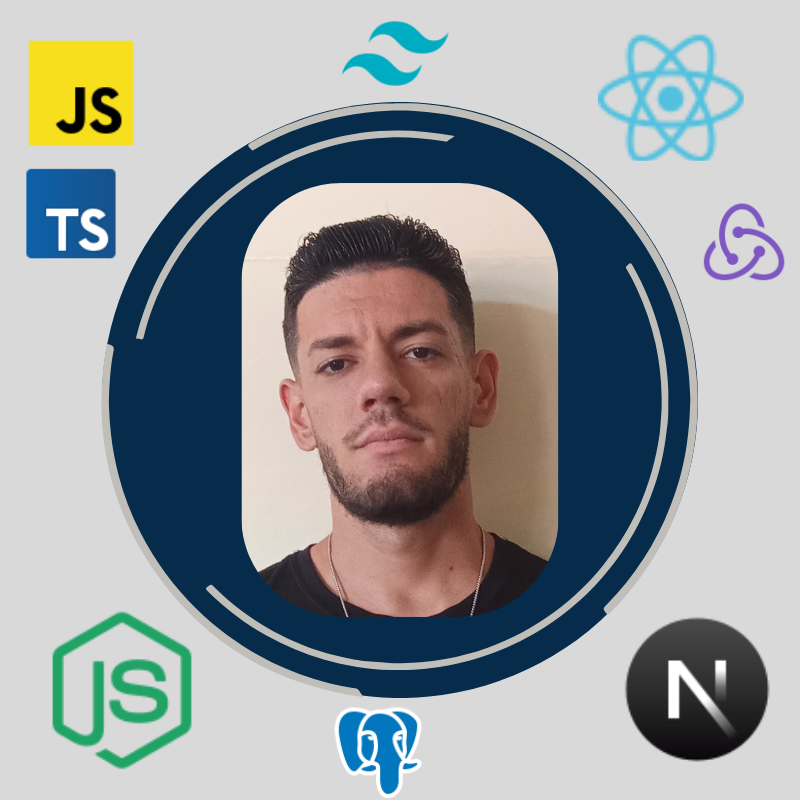

# Hi 👋, I'm Nelson Alejandro Cruz Borrego

### A passionate full-stack developer

    

  

- 🔭 I'm currently working on **Inventory full-stack app **

- 🌱 I'm currently learning **Django**

- 📫 How to reach me **cruznelsonalejandro@gmail.com**

- ⚡ Fun fact **I am disciplined, punctual, organized, adaptable, and resilient**

- 👨‍💻 All of my projects are available at **[https://portfolio-project-nelsonacb-nelson-alejandros-projects.vercel.app/en](https://portfolio-project-nelsonacb-nelson-alejandros-projects.vercel.app/en)**

- 📄 Know about my experiences **[https://drive.google.com/file/d/1pL04lJ1g-JsO0XCvLwOAl2s9yz9NINdF/view?usp=drive_link](https://drive.google.com/file/d/1pL04lJ1g-JsO0XCvLwOAl2s9yz9NINdF/view?usp=drive_link)**

<h3 align="left">Connect with me:</h3>

<h3 align="left">Languages and Tools:</h3>

                  

&nbsp;

